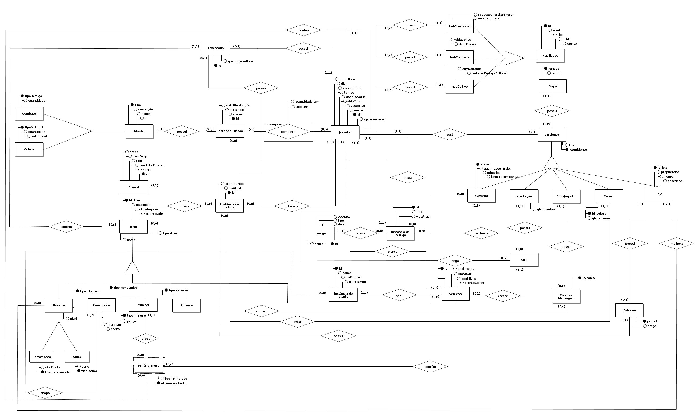
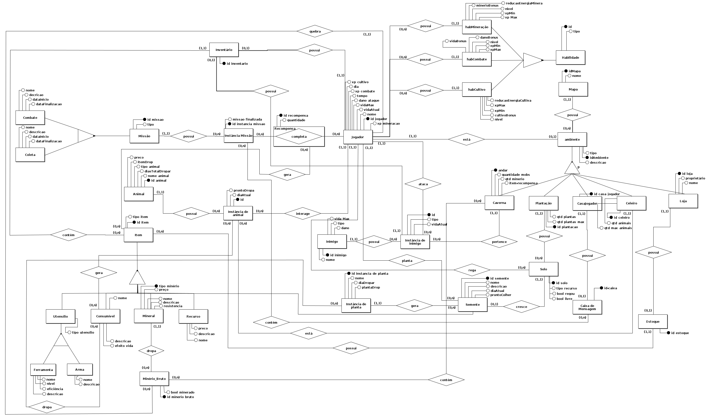

O Diagrama Entidade-Relacionamento (DER) é uma representação gráfica que descreve a estrutura lógica do banco de dados do jogo. Ele ilustra as principais entidades do sistema, seus atributos, chaves primárias e secundárias, bem como os relacionamentos existentes entre essas entidades. Além disso, o DER reflete as restrições estruturais e a lógica de negócio envolvida no funcionamento do jogo. 

No contexto do nosso projeto inspirado em Stardew Valley, o DER fornece uma visão clara e organizada das informações essenciais, como os itens no inventário do personagem, os recursos coletados nas minas, as plantas cultivadas na fazenda e os ambientes exploráveis, como a caverna e a loja. Ele serve como base para a criação e manutenção do banco de dados, garantindo que todos os dados do sistema estejam interconectados de maneira eficiente e lógica, alinhados aos objetivos do jogo.

=== "<a href="#anchor-link-modulo1" tabindex="-1">Módulo 1</a>"

    
Figura 1: DER versão 1

    

        
    

    
Fonte: Elaboração própria

=== "<a href="#anchor-link-modulo2" tabindex="-1">Módulo 2</a>"

    
Figura 1: DER versão 2

    

        
    

    
Fonte: Elaboração própria

## Versionamento

| Data | Versão | Autor | Alterações | 
| :--: | :----: | ----- | ---------- | 
| 23/11/2024 | `1.0` | [Manuella Valadares](https://github.com/manuvaladares) | Criação do documento DER |
| 13/01/2025 | `1.1` | [Marcos Marinho](https://github.com/devMarcosVM) | Atualização do documento DER |
