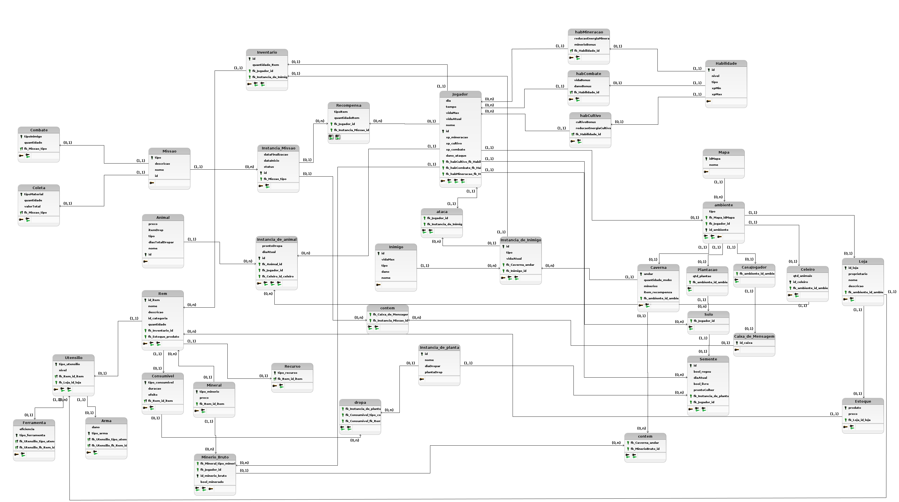

  
# Modelo Relacional

O Modelo Relacional(MREL) apresenta um diagrama lógico de como as entidades e seus devidos relacionamentos serão mapeados no bando de dados, por isso é um modelo não atrelado a nenhum tipo de sistema de gerenciamento de banco de dados (SGBD) específico. 

  
 

Figura 1: MREL versão 1

Fonte: Elaboração própria

## Versionamento

| Data | Versão | Autor | Alterações | 
| :--: | :----: | ----- | ---------- | 
|23/11/2024| `1.0`| [Manuella Valadares](https://github.com/manuvaladares)| Versão Inicial do Modelo relacional(MREL)|