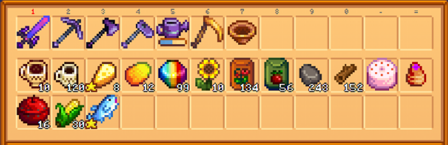
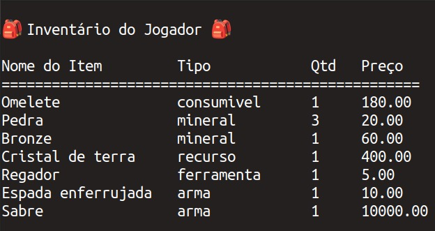
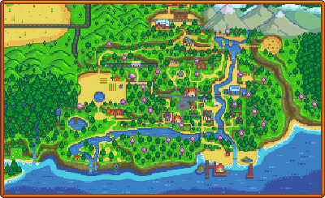
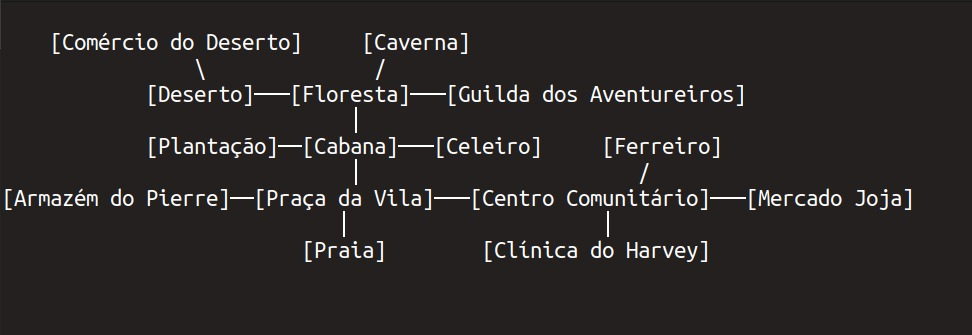
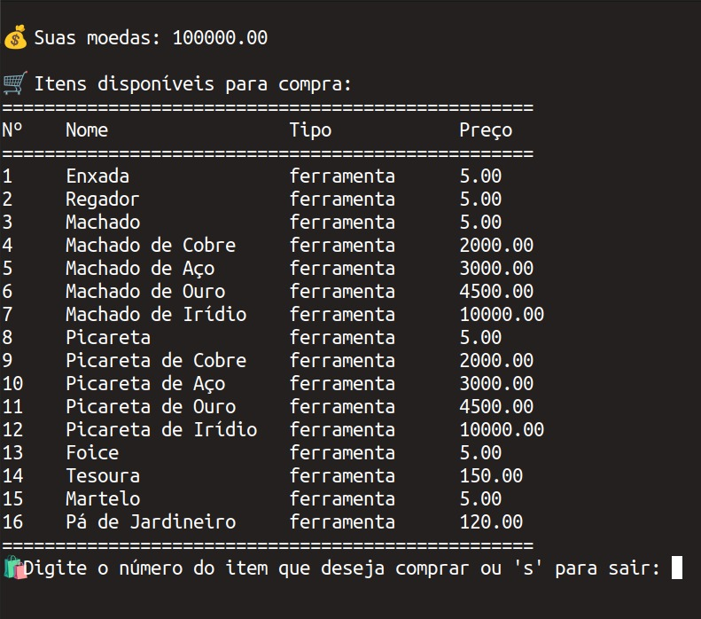
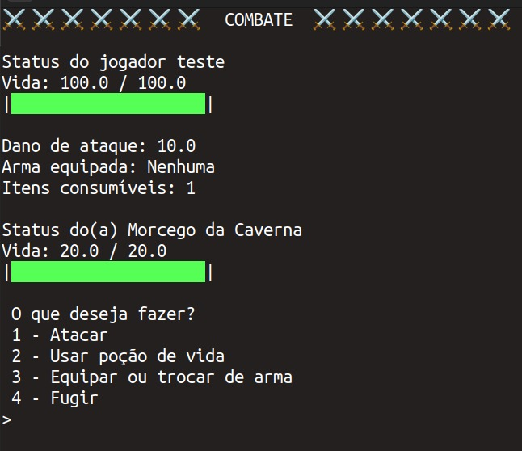
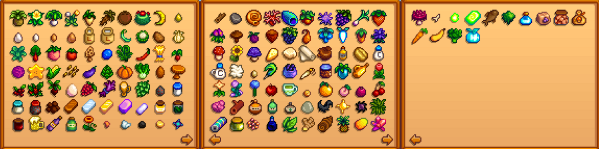

## Manual do Jogador - MUD inspirado em Stardew Valley


**Bem-vindo(a) ao mundo do nosso MUD inspirado em Stardew Valley!**  
Neste manual, você encontrará informações essenciais para entender e aproveitar ao máximo as mecânicas do jogo.

<div style="display: flex; text-align: center; width: 330px;">
    
    
</div>

---

## **1. Objetivo do Jogo**
Seu objetivo é gerenciar recursos, explorar a caverna da vila, interagir com os ambientes e principalmente **evoluir suas habilidades** enquanto vive como um fazendeiro(a) em um mundo repleto de aventuras e desafios.


## **2. Funcionalidades do Jogo**
Com base no modelo do jogo, você terá acesso às seguintes interações:

### **2.1. Jogador**
- Cada jogador inicia com 3 habilidades para desenvolver: Cultivo, Combate e Mineração. A vida da cidade nunca iria te proporcionar essas habilidades, aproveite!
- Cada jogador inicia com 1000 moedas para entrar na nova vida com o pé direito!
- Você pode equipar ferramentas, armas e coletar itens, como minérios, plantas e recursos.
- Você tem em sua fazenda uma plantação descampada e um celero empoeirado, traga vida com novas plantas e animais.

<font size="2"><p style="text-align: center">Figura 1: Menu do jogador</p></font>

<center>
    
</center>

<font size="2"><p style="text-align: center">Fonte: Elaboração própria, 2025</p></font>

### **2.2. Inventário**
O inventário consiste no conteúdo da mochila do jogador. Os espaços proporcionam ao jogador acesso imediato a certos itens e viaja com o jogador ao redor do mapa. Este acesso é crucial no jogo, pois define a lista de itens com os quais o jogador pode trabalhar enquanto participa de atividades do jogo. É um elemento importante do jogo para garantir que o inventário contenha os itens necessários para todas as tarefas em todos os momentos. Seu limite de tamanho pode apresentar desafios no planejamento e impor mudanças na ordem a que as coisas devem ser feitas.

<font size="2"><p style="text-align: center">Figura 2: Exemplo de um inventário</p></font>

<center>
    
</center>

<font size="2"><p style="text-align: center">Fonte: [Stardew Wiki](https://pt.stardewvalleywiki.com/), 2025</p></font>


<font size="2"><p style="text-align: center">Figura 3: Inventário do jogador</p></font>

<center>
    
</center>

<font size="2"><p style="text-align: center">Fonte: Elaboração própria, 2025</p></font>

### **2.3. Ambientes**
- O jogo é dividido em diferentes ambientes, cada um com suas características únicas
- Você pode comprar e vender itens nas lojas, se aventurar na caverna, conhecer os lugares da Vila e viajar até o deserto.

<font size="2"><p style="text-align: center">Figura 4: Mapa de onde o jogo original se passsa</p></font>

<center>
    
</center>

<font size="2"><p style="text-align: center">Fonte: [Stardew Wiki](https://pt.stardewvalleywiki.com/), 2025</p></font>

- No nosso MUD, de um mesmo ambiente você pode transitar para até 6 outros, as rotas estão definidas nas opções do terminal.
- O jogador carrega um mapa da vila que pode ser aberto em qualquer lugar, contendo todos os caminhos possíveis.

<font size="2"><p style="text-align: center">Figura 5: Mapa de onde o jogo da matéria se passa</p></font>

<center>
    
</center>

<font size="2"><p style="text-align: center">Fonte: Elaboração própria, 2025</p></font>

### **2.4. Itens**
Os itens se dividem nas seguintes categorias:

- **Ferramentas:** Usadas para interagir com o ambiente. Exemplo: Enxada, Picareta.

- **Armas:** Necessárias para enfrentar inimigos em combate.

- **Consumíveis:** Itens que restauram energia ou vida, como frutas e alimentos.

- **Minérios e Recursos:** Obtidos na caverna ou na floresta.

Você pode ir até a loja para vender e comprar itens com as suas moedas.

<font size="2"><p style="text-align: center">Figura 6: Itens a venda na loja do ferreiro</p></font>

<center>
    
</center>

<font size="2"><p style="text-align: center">Fonte: Elaboração própria, 2025</p></font>

## **2.6. Inimigos**
- Enfrente inimigos em locais como a caverna.
- Cada inimigo possui atributos como **vida** e **dano**.
- Ao comater inimigos, você aumenta a sua Habilidade de Combate.

<font size="2"><p style="text-align: center">Figura 7: Menu de combate do nosso jogo</p></font>

<center>
    
</center>

<font size="2"><p style="text-align: center">Fonte: Elaboração própria, 2025</p></font>

---

## **3. Habilidades**
Os jogadores podem desenvolver habilidades em três áreas principais:

- **Habilidade de Cultivo:** Melhora a eficiência nas plantações.

- **Habilidade de Mineração:** Aumenta a chance de obter minérios raros.

- **Habilidade de Combate:** Melhora o dano causado e reduz o dano recebido.

---

## **4. Interações**
### **4.1. Cultivo**
- Venda suas colheitas na loja ou use-as como itens consumíveis.

<font size="2"><p style="text-align: center">Figura 8: Consumíveis do jogo base</p></font>

<center>
    
</center>

<font size="2"><p style="text-align: center">Fonte: [Stardew Wiki](https://pt.stardewvalleywiki.com/), 2025</p></font>


### **4.2. Mineração**
- Entre na caverna para minerar pedras e coletar recursos preciosos.
- Use picaretas para quebrar rochas e descubra minérios raros.

### **4.3. Loja**
- Troque recursos por moedas ou adquira novos itens para facilitar o progresso no jogo.

### **4.4. Animais**
- Crie animais no celeiro para obter recursos como leite, ovos e lã.
- Cuide bem deles para manter a produção.

---

## **5. Progressão no Jogo**
- Melhore suas ferramentas, armas e habilidades para enfrentar desafios mais difíceis.
- Gerencie bem seu tempo e energia para otimizar seu desempenho.

---

## **6. Dicas para Jogadores Iniciantes**
- Sempre leve ferramentas e consumíveis para suas explorações.
- Gerencie bem seu inventário para evitar ficar sem espaço.
- Atualize suas ferramentas para melhorar a eficiência.
- Cuidado com o tempo! Se você ficar muito exausto, pode desmaiar e perder dinheiro para a clínica do Harvey.

---

## **7. Regras Gerais**
1. Respeite os limites de energia e vida do personagem.
2. Gerencie seus recursos com cuidado, evitando desperdícios.
3. Complete missões e treine suas habilidades para avançar no jogo.

---

Divirta-se explorando este mundo repleto de possibilidades! Que sua jornada seja próspera! 🌱

## **8. Guia para Rodar o Jogo**

### Pré-requisitos

Antes de começar, verifique se você tem os seguintes itens instalados em sua máquina:

- **Python** (versão 3.7 ou superior)
- **Pip** (gerenciador de pacotes Python)
- **Docker** e **Docker Compose** (para gerenciamento de contêineres)
- **Sistema Operacional Linux** 

### 1. Clonar o Repositório

Execute o seguinte comando no terminal para clonar o repositório do projeto:

```bash
git clone https://github.com/SBD1/2024.2-StardewValley.git
```

### 2. Entrar na Pasta do Jogo

Acesse o diretório do jogo usando o comando:

```bash
cd 2024.2-StardewValley/game
```

### 3. Inicializar o Docker

Inicie o contêiner Docker no modo em segundo plano (background) com o comando:

```bash
docker compose up -d
```

### 4. Rodar o Jogo

Por fim, execute o seguinte comando para iniciar o jogo:

```bash
python3 main.py
```

### Observações Importantes

- Caso encontre problemas ao executar algum dos comandos, verifique se todos os pré-requisitos estão devidamente instalados e configurados.
- Certifique-se de que o Docker está ativo antes de iniciar o contêiner.

---

## Bibliografia

> 1. Stardew Wiki. Disponível em: [Stardew Wiki](https://pt.stardewvalleywiki.com/).

| Data | Versão | Autor | Alterações | 
| :--: | :----: | ----- | ---------- | 
| 06/02/2025 | `1.0` | [Manuella Magalhães Valadares](https://github.com/manuvaladares) | Criação do documento |
| 08/02/2025 | `1.1` | [Gabriel Fernando de Jesus Silva](https://github.com/MMcLovin) | Adiciona fontes das imagens |